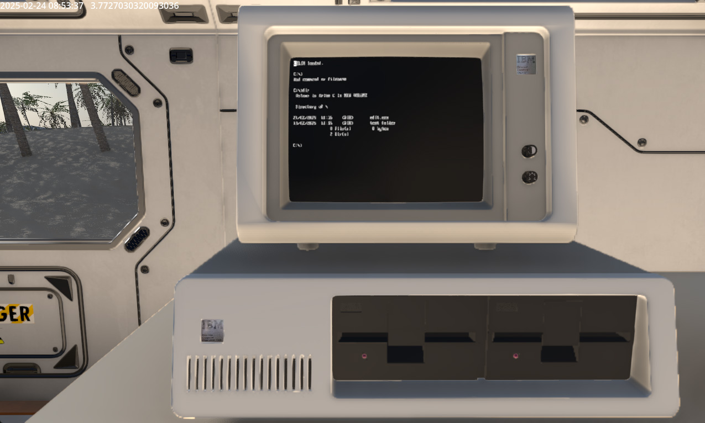
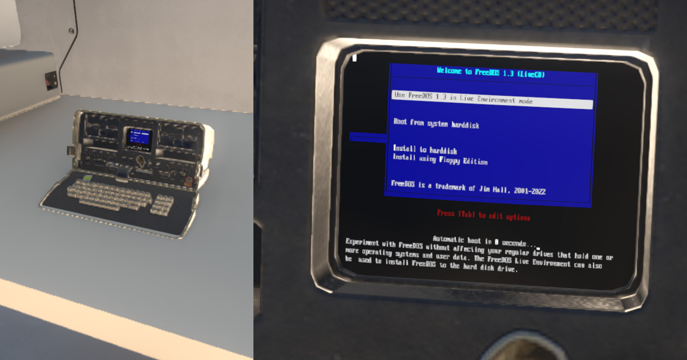
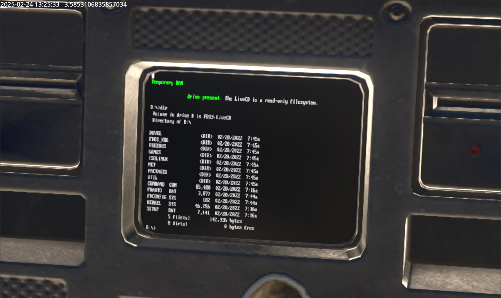
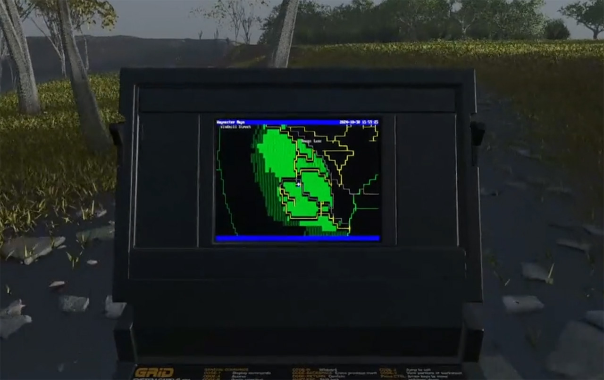
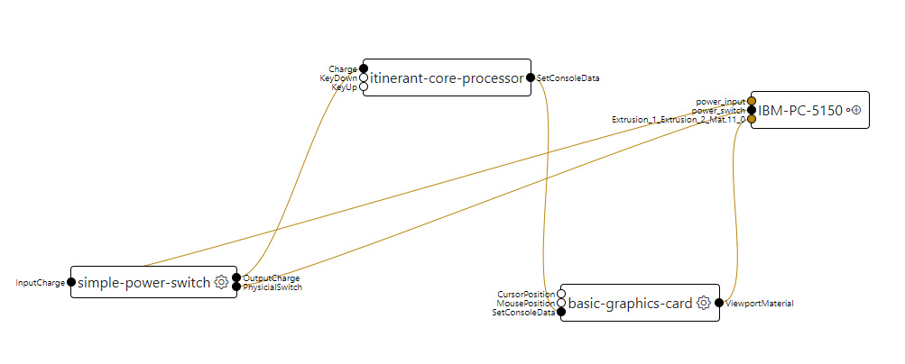
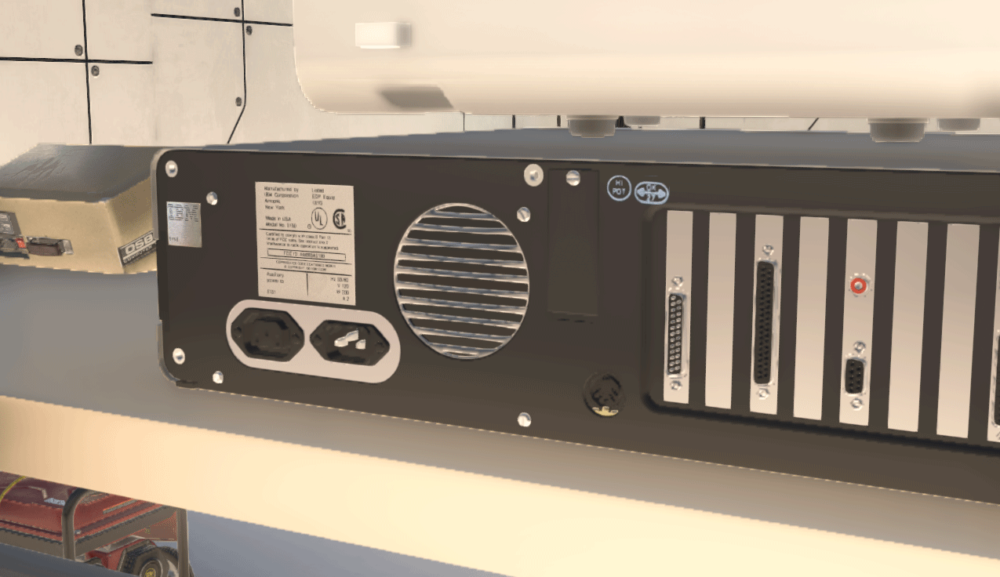
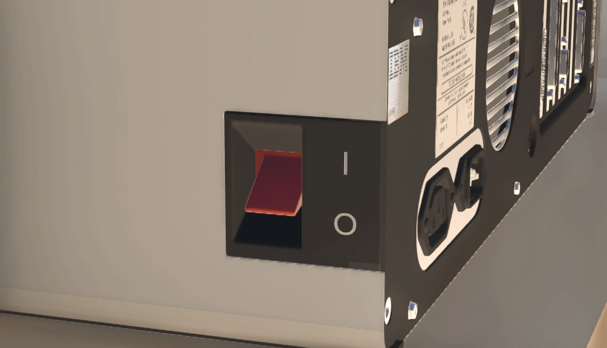
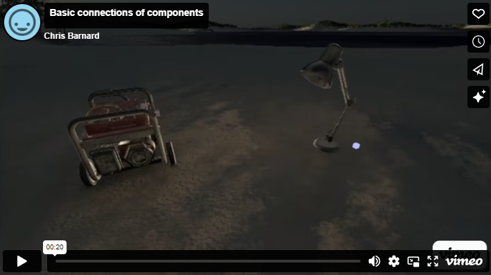
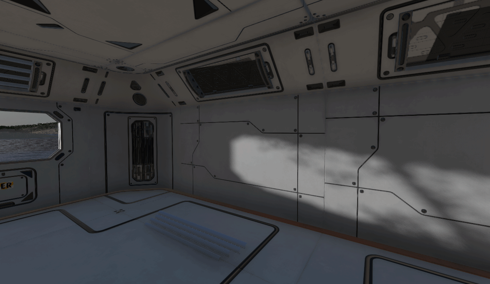

# Technology in Itinerant

Building on the question of _‘what would have happened if the 60s - 70s space race continued into the 80s?’_, Itinerant’s technology is heavily influenced by late-70’s to mid-80’s design language and technical capabilities, not only in terms of real technology but also the technology and styles found in sci-fi films from this period.

CRT displays, vector graphics, console-based terminals all contribute to the look and feel of the Itinerant universe.

However, it’s more than just a ‘look’. All the computer terminals, devices, keyboards, switches, power generators, sensors, lights, etc, actually work and can be interacted with, taken apart, repaired and salvaged for parts.

> _An IBM PC 5150 running a custom version of DOS_

> _An Osborne 1 Luggable PC running FreeDOS via QEMU_

> _Typing on the Osborne 1 works - you can interact with the virtual machine_

> _A 1980's GRiD Laptop running some custom mapping software - the map updates as you walk around the terrain. In this example, a portion of planet Earth has been generated within Itinerant (complete with roads, trees, terrain and subterranean geology) and the mapping data comes from OpenStreetMap_

Nothing is hard-coded in Itinerant. 3D objects in Itinerant’s universe can contain scriptable components with inputs and outputs. These inputs and outputs can then be hooked up by the player to create complex running machines from basic building blocks.

In this way, players can hunt for parts to build their devices – computer chassis can have their processors swapped out, different displays can be connected up (eg, monochrome monitors may be replaced with colour versions), different software can be run or even created - new and interesting devices can be built unique to each player’s inventory as they discover new items in the world around them.

> _A screenshot from the Itinerant's server backend - used to edit objects, materials and components found within the game_

Inputs and outputs can be virtual and connected internally within the 3D object (for example as shown in the screenshot above from Itinerant’s backend server management system), or can be physical so that players can hook up or rewire devices:

> _The back of the IBM PC, showing the VGA output and power inputs can be connected up to other devices. Red connections indicate outputs, blue connections are inputs_

Interactive elements within objects can easily be implemented by the designer and used by the player:

> _The aim is to make it relatively easy to define part of a mesh as interactable and go as far as animating it, simply by selecting that part of the mesh in the server CMS and defining what it does. This switch is an example of taking a generic asset from the fab.com store and being able to quickly import it into Itinerant. The hope is that 3D designers will be able to work with Itinerant without much of a learning curve or any changes to their existing workflows._

Inputs and outputs can not only be connected by cables; objects can contain sockets allowing other objects to be plugged directly into them.

Once an object is plugged in, connections will automatically be completed – for example in the instance of a lightbulb, if power is flowing to the desk lamp, the lightbulb will illuminate when plugged in.

> _Placing fluorescent tubes in wall fitting._

Objects also have the ability to retain information about their state in between play sessions. For example, if a device is left switched on when last played, it will still be on when the player comes back. Parameters stored for objects are completely customizable, making it possible to log information about the runtime of an object, damage that has been inflicted upon it, or anything that needs to be recalled later. For example, a fluorescent light may start flickering after a certain amount of runtime, or fuses in a circuit breaker might blow in the event of a power surge.

This doesn’t just apply to technology in Itinerant – any object can contain script and parameters that define it. One such example are certain types of trees - they can be created so that they are unique every time they spawn, and grow over time. Since these elements can be scripted on Itinerant's server without the need for recompilation, anything imaginable can be imported into the game and used by the player.

[Next: Objectives for the Player](3.-Objectives.html){: .float-right }
