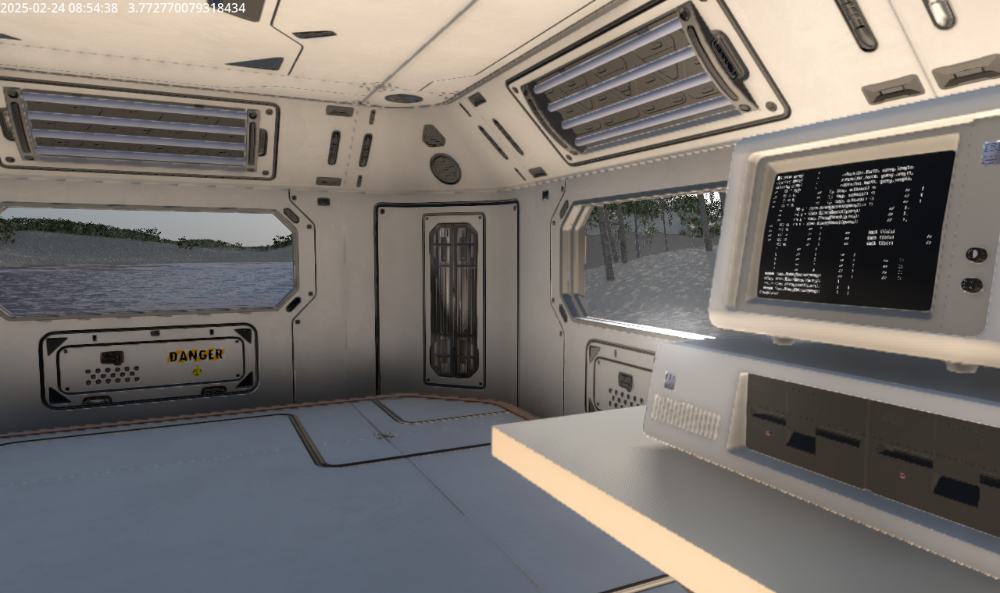
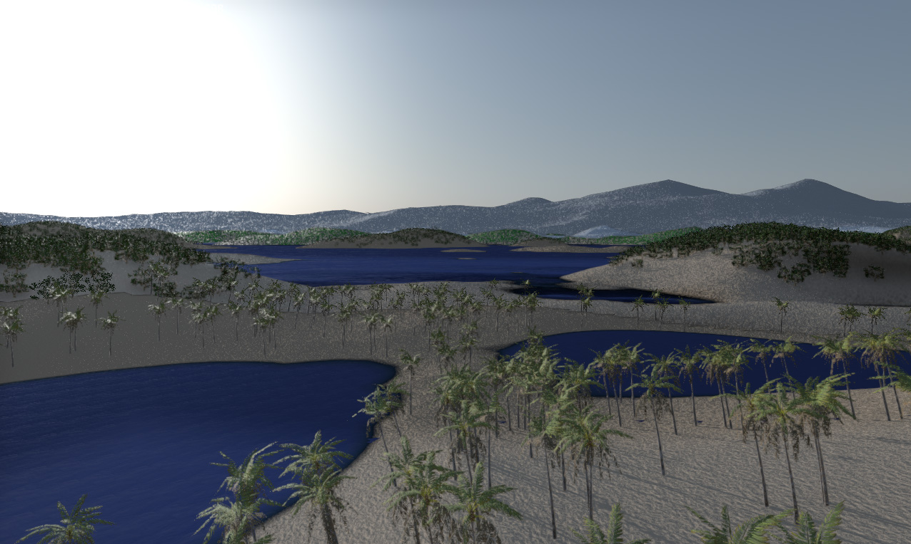
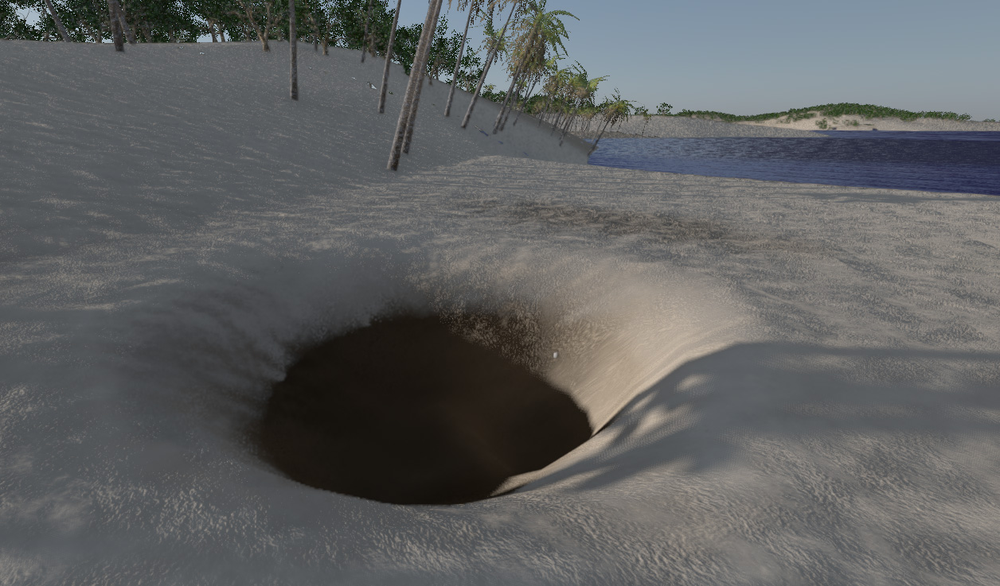
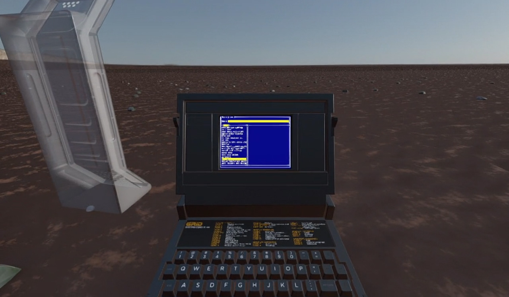

## _It's the 1980's, but in space..._

Itinerant is a first-person open-world multiplayer survival/sandbox game based around the main concepts of resource-gathering, building, exploring, taking part in challenges and interacting with other players.

Whilst these topics tread well-worn ground in gaming history, Itinerant has several features and directions which will provide a unique and new gaming experience for both casual and hardcore gamers alike.

> _Note: All screenshots shown in this Wiki are taken directly from an early alpha build of Itinerant, and do not necessarily represent the intended quality of the finished game_

## Planets, solar systems, galaxies...

Itinerant's planetary system accurately simulates planets orbiting around stars, taking into account their orbital period, axial tilt, rotation time, orbital inclination, distance and radius. When a player is stationary on a planet, the stars in the sky are accurately positioned - days pass in real time, the sun will be in the correct place in the sky, seasons will change how the light falls on the ground.

Planets have a file system that infers volumetric information, and can have multiple layers of minerals under the ground. The system is designed to mimic real geological formations and therefore pockets of minerals and faultlines can appear, and this can be procedurally generated or fed from stored data.

> _A procedural planet with different vegetation and geology based on height. The terrain generation system in Itinerant has been abstracted so that different terrain generators can be developed. Currently there are several basic procedural terrain generators, and a version that supports taking DTM/LIDAR data alongside other planetary information to generate real-world locations, such as Planet Earth and Mars._

> _When you dig holes or place materials on the ground, this information persists and can either be stored locally so that only the player sees it, or committed back to the server so the changes are visible to all._

## Explore the galaxy, build communities, play together or alone

While Itinerant is designed to provide a multifaceted experience, the current focus is on narrowing the gameplay down to a specific set of manageable sections for a first stage release, and then iteratively releasing additional features over time. Key gameplay elements have been defined as:

- A fully immersive experience. _Everything_ happens within the 3D environment with no need for graphical overlays or jarring loading screens.
- A build system that feels realistic within the universe, with far greater customization options than has ever been seen before.
- A multiplayer mode from day one, although leaning heavily on individual experiences to begin with, being aware of the fact that there still needs to be a playable and interesting game worth spending time in even if there aren't many people online, or they're spread out too thinly across a galaxy.

